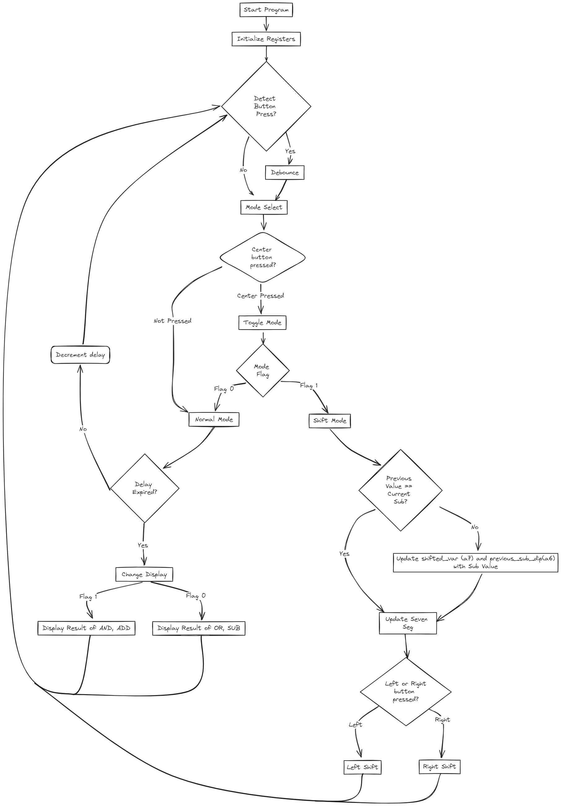

## RISC-V Instructions Implemented

### Essential Instructions

| Instructions         | Description                    | Implemented |
| -------------------- | ------------------------------ | ----------- |
| `add`                | `rd = rs1 + rs2`               | &#9745;     |
| `addi`               | `rd = rs1 + imm`               | &#9745;     |
| `sub`                | `rd = rs1 + rs2`               | &#9745;     |
| `and`                | `rd = rs1 & rs2`               | &#9745;     |
| `andi`               | `rd = rs1 & imm`               | &#9745;     |
| `or`                 | `rd = rs1 \| rs2`              | &#9745;     |
| `ori`                | `rd = rs1 \| imm`              | &#9745;     |
| `lw`                 | `rd = M[rs1+imm][0:31]`        | &#9745;     |
| `sw`                 | `M[rs1+imm][0:31] = rs2[0:31]` | &#9745;     |
| `beq`                | `if(rs1 == rs2) PC += imm`     | &#9745;     |
| `bne`                | `if(rs1 != rs2) PC += imm`     | &#9745;     |
| `jal` (without link) | `rd = PC+4; PC += imm`         | &#9745;     |

### Additional Instructions
| Instructions | Description             | Implemented |
| ------------ | ----------------------- | ----------- |
| `lui`        | `rd = imm << 12`        | &#9745;     |
| `auipc`      | `rd = PC + (imm << 12)` | &#9745;     |
| `sll`        | `rd = rs1 << rs2`       | &#9745;     |
| `srl`        | `rd = rs1 >> rs2`       | &#9745;     |
| `sra`        | `rd = rs1 >> rs2`       | &#9745;     |

### Programme Flow

### Programme Description
- There are 2 modes in the programme <b>shifting mode</b> and <b>normal mode</b>
- The DIPs Switches are used as numerical inputs for the programme, split into DIPS[15:8] and DIPS[7:0]
- The programmes checks for button presses
- BtnC:
  - Toggles between <b>shifting mode</b> and <b>normal mode</b>
- BtnL:
  - Only used during <b>shifting mode</b>
  - Conducts `sll` on  `DIPS[15:8] - DIPS[7:0]`
- BtnR:
  - Only used during <b>shifting mode</b>
  - Conducts `sra` on  `DIPS[15:8] - DIPS[7:0]`
  
- <b>Normal Mode</b>
  - It alternates between 2 display views
  - Display View 1:
    - LED shows `DIPS[15:8] and DIPS[7:0]`
    - 7-Segment shows `DIPS[15:8] + DIPS[7:0]`
  - Display View 2:
    - LED shows `DIPS[15:8] or DIPS[7:0]`
    - 7-Segment shows `DIPS[15:8] - DIPS[7:0]`

- <b>Shifting Mode</b>
  - LEDs are turned off
  - 7-Segment shows `DIPS[15:8] - DIPS[7:0]`
  - BtnL and BtnR controls the shifting of `DIPS[15:8] - DIPS[7:0]`
  - Checks if previous value of the DIPs switches has been altered 
  - If the value of the DIPS did not change, the shifted value shown on the 7-Segment display will remain
  - If the value of the DIPS changed, the shifted value shown on the 7-Segment display will reset to `DIPS[15:8] - DIPS[7:0]`  

### Variables
| Name  | Description                       |
| ----- | --------------------------------- |
| `s1`  | LEDs Address                      |
| `s2`  | DIPs Address                      |
| `s3`  | PBS Address                       |
| `s4`  | Seven Segement Address            |
| `s5`  | Delay Value for Display           |
| `s6`  | DIPS [15:8] and DIPS [7:0]        |
| `s7`  | DIPS [15:8] or DIPS [7:0]         |
| `s8`  | DIPS [15:8] + DIPS [7:0]          |
| `s9`  | DIPS [15:8] - DIPS [7:0]          |
| `s10` | Flag for Display                  |
| `s11` | Debounce Delay Amount             |
| `t0`  | Value of DIPs                     |
| `t1`  | DIPS [7:0]                        |
| `t2`  | Shift Constant (8)                |
| `t3`  | DIPS [15:8]                       |
| `t4`  | PBS Value                         |
| `t5`  | UNUSED                            |
| `t6`  | Shift Constant (1)                |
| `a2`  | Left Button Flag                  |
| `a3`  | Center Button Flag                |
| `a4`  | Right Button Flag                 |
| `a5`  | Mode Flag                         |
| `a6`  | Previous DIPS [15:8] - DIPS [7:0] |
| `a7`  | Previous Shifted Value            |